# El Gran Mestizo

Proyecto final para la asignatura de **Desarrollo de aplicaciones web**.

---

## Concepto del restaurante

**El Gran Mestizo** es un restaurante de autor que celebra la riqueza culinaria mexicana a través de una experiencia inmersiva, personalizada y sin distracciones. Nuestro formato está diseñado bajo el enfoque de **menú de degustación** o *tasting menu*, una práctica reconocida internacionalmente en la alta cocina.

Esto significa que no se ofrece un menú tradicional con platos a la carta y precios visibles, sino una **selección curada de tiempos** elaborada diariamente por nuestro chef, en función de ingredientes frescos, temporada y creatividad gastronómica.

---

## 🍽️ ¿Por qué no hay precios en la carta?

La ausencia de precios no es una omisión, sino una elección consciente y parte integral de la experiencia:

- **Precio fijo:** Los comensales pagan una tarifa única por persona que incluye todos los tiempos del menú, con opción a maridaje si así lo desean.
- **Sin decisiones, sin distracciones:** Buscamos liberar al cliente de tener que decidir qué pedir o cuánto gastar, permitiendo que se enfoque completamente en disfrutar la experiencia.
- **Menú cambiante:** El menú varía constantemente, adaptándose a la creatividad del chef y la disponibilidad de productos. Mostrar precios por platillo sería incompatible con esta dinámica.
- **Experiencia guiada:** El servicio está pensado como una narrativa gastronómica, donde cada tiempo está diseñado para tener una continuidad y un propósito dentro del recorrido.

En el sistema de gestión desarrollado para **El Gran Mestizo**, el modelo `platillo` no incluye precios visibles para el cliente final, ya que su función es únicamente interna y descriptiva. Los platos listados representan ejemplos de lo que puede ofrecerse en un menú, no un catálogo de opciones.

Este enfoque permite:

- Flexibilidad absoluta para modificar menús día con día.
- Una experiencia uniforme para todos los comensales.
- Separación entre el contenido visual público y la lógica de precios, que se maneja de forma independiente (por ejemplo, a través del módulo de reservaciones y facturación).

---

## Proyecto

Este proyecto de **Desarrollo de aplicaciones web** (**Profesor:** Jesus Mares Montes) fue diseñado, programado y documentado por:

- [Martinez Peña Francisco Javier](https://github.com/fjmp20)
- [Coria Caballero Angel Emanuelle](https://github.com/Coria322)

---

## Tecnologías utilizadas

- **Backend:** Laravel 12 (PHP).
- **Frontend:** Blade, HTML5, CSS3, JavaScript.
- **Base de Datos:** MySQL, Eloquent.
- **Autenticación personalizada**
- **Control de versiones:** Git & GitHub
- **Otros:** Composer, Laravel Artisan, Npm, PHPUnit (para pruebas)

---

## Requerimientos

**El Gran Mestizo** fue desarrollado como un sistema de gestión de reservaciones para restaurante. Contiene módulos principales como:

- **Gestión de usuarios:** Permite registrar usuarios que un administrador puede gestionar (eliminación, cambio de rol, vista de datos).
- **Reservación en línea:** Permite a los clientes reservar mesas para una fecha y hora específicas. El sistema está diseñado para asignar automáticamente un mesero y la cantidad de mesas necesarias para la reserva.
- **Gestión del menú:** El sistema permite gestionar los platillos, imágenes y descripciones que aparecerán en el panel de bienvenida. Esta gestión permite:
    - *Ingresar nuevos platillos al menú.*
    - *Modificar platillos existentes (nombre, descripción, imágenes).*
    - *Realizar eliminaciones lógicas ("inactivar" el platillo sin eliminarlo del menú).*
    - *Realizar eliminaciones físicas (eliminar el platillo de la base de datos).*
- **Control de disponibilidad:** La aplicación considera un horario de 12:00 a 22:00 para las reservaciones. Utiliza un sistema inteligente que asigna mesas disponibles, meseros en turno y evita colisiones entre reservas (múltiples reservas en el mismo lugar a la misma hora). Esta funcionalidad usa consultas a BD y lógica de negocio para habilitar solo días y horas disponibles en el calendario de reservas.
- **Panel de administración general:** Este panel permite administrar todo el sistema, requiere un rol de usuario `ADMINISTRADOR` y permite:
    - *Gestión completa de usuarios (ver datos, eliminar usuarios, modificar usuarios).*
    - *Operaciones CRUD sobre mesas (crear, ver, editar, eliminar).*
    - *Gestión completa de empleados.*
    - *Gestión de reservaciones (ver datos y eliminar reservas).*
    - *Gestión de acciones de menú.*
    - *Ver y eliminar reportes realizados por empleados o clientes.*
    - *Personalizar información de administrador.*

---

## Autenticación y autorización personalizada

El sistema de **El Gran Mestizo** implementa una **autenticación y autorización completamente personalizada**, desarrollada desde cero sin depender de paquetes externos como Laravel Breeze o Jetstream.

Incluye:

- **Inicio de sesión y registro manual** usando validaciones propias en el backend.
- **Hashing seguro de contraseñas** con `Hash::make()` y verificación con `Hash::check()`.
- **Recuperación de contraseña por correo electrónico** mediante tokens únicos generados y validados manualmente.
- **Middleware personalizado de autenticación y autorización** para restringir rutas según el tipo de usuario:
  - `CLIENTE`: Accede a su perfil y sistema de reservaciones.
  - `EMPLEADO`: Puede registrar acciones, consultar reportes y atender reservas.
  - `ADMINISTRADOR`: Accede a todo el panel de gestión del sistema.
- **Control de sesiones activas**, protección contra CSRF y validaciones estrictas en cada operación sensible.
- **Roles gestionados por relaciones en la base de datos**, usando un único modelo `Usuario` con claves foráneas hacia `Cliente`, `Empleado` o `Administrador`.

Gracias a este enfoque, el sistema ofrece:

- Mayor flexibilidad para personalizar los flujos de autenticación.
- Independencia de paquetes externos.
- Control total del comportamiento de login, logout, recuperación y permisos.

---

### Controlador de inicio de sesión (`loginController`)

El controlador `loginController` maneja las funcionalidades esenciales de autenticación:

- **Mostrar formulario de login** si no está autenticado, o redirigir al panel correspondiente si ya lo está.
- **Validar y autenticar credenciales** manualmente contra el modelo `Usuario` usando el guard `Usuario`.
- **Redirigir según rol** a los paneles de administrador, empleado o cliente.
- **Cerrar sesión** invalidando la sesión y regenerando tokens para evitar riesgos de seguridad.

---

### Middleware de autenticación y autorización

Para proteger las rutas y controlar el acceso, se implementan dos middlewares clave:

- **Authenticate:** Verifica que el usuario esté autenticado usando el guard `Usuario`. Si no, redirige a la ruta de login.
- **CheckUserType:** Valida que el usuario autenticado tenga el rol requerido para acceder a una ruta específica. Si no, devuelve error 403 con mensaje claro.

**Uso en la aplicación:**

- `Authenticate` se aplica en los constructores de los controladores que requieren protección.
- `CheckUserType` se utiliza en las definiciones de rutas para restringir por rol, por ejemplo:

```php
Route::middleware(['auth:Usuario', 'userType:ADMINISTRADOR'])->group(function () {
    // Rutas solo para administradores
});
```

---

## Módulo de Recuperación de Contraseña

El sistema de **El Gran Mestizo** implementa un proceso personalizado para la recuperación de contraseñas que garantiza seguridad y facilidad para el usuario. A continuación se describe su funcionamiento y estructura.

---

### Flujo de recuperación de contraseña

1. **Solicitud de recuperación:**

   * El usuario ingresa su correo electrónico en el formulario de recuperación.
   * Se valida que el correo exista en la tabla `usuarios`.
   * Se genera un token aleatorio seguro de 60 caracteres.
   * El token se almacena o actualiza en la tabla `password_resets` junto con la fecha y hora de creación.
   * Se envía un correo electrónico al usuario con un enlace único que contiene el token.

2. **Formulario para establecer nueva contraseña:**

   * Al hacer clic en el enlace del correo, el usuario accede a un formulario para ingresar y confirmar su nueva contraseña.
   * El token se valida y debe existir en la tabla `password_resets`.
   * El token expira después de 60 minutos para garantizar seguridad.

3. **Restablecimiento de contraseña:**

   * Se validan las contraseñas con reglas estrictas: mínimo 8 caracteres, uso de mayúsculas, minúsculas, números y símbolos.
   * Si el token es válido y no ha expirado, se actualiza la contraseña del usuario en la base de datos.
   * La contraseña se guarda usando hashing seguro (Laravel lo maneja automáticamente al asignar al campo `password` o puedes aplicar `Hash::make` explícitamente).
   * El token se elimina de la tabla `password_resets` para evitar reutilización.
   * Se redirige al usuario a la página de login con un mensaje de éxito.

---

### Controlador `PwdController`

Este controlador maneja toda la lógica mencionada en el flujo:

* `mostrarSolicitud()` — Retorna la vista con el formulario para solicitar la recuperación.
* `enviarCorreo(Request $request)` — Valida el correo, genera token, lo almacena y envía el correo con el enlace.
* `mostrarFormulario($token)` — Muestra el formulario para ingresar nueva contraseña, validando el token.
* `resetearPassword(Request $request)` — Valida los datos, verifica el token, actualiza la contraseña y elimina el token.

---

### Seguridad y buenas prácticas

* Validación estricta de correo y contraseña.
* Tokens únicos y de longitud segura (60 caracteres aleatorios).
* Expiración de tokens a los 60 minutos para evitar ataques.
* Eliminación inmediata del token usado para evitar reutilización.
* Uso de las reglas de validación de Laravel para contraseñas robustas (`Password::min(8)->mixedCase()->numbers()->symbols()`).
* Manejo de errores claro y amigable para el usuario.

---

### Ejemplo del enlace enviado por correo

El enlace tiene la siguiente forma:

```
http://dominio.com/password/reset/vKXk2wSz1XvNWXqIvVy0BCddUU9263137nI2GnN4rgGIiLWzoLk3kcsW5BfD
```

(al ser localhost actualmente no existe un dominio realmente accesible)

---

## Módulo de reservas

El sistema de **El Gran Mestizo** permite realizar, consultar, actualizar y cancelar reservaciones en línea, de forma automatizada y robusta. A continuación se detalla el funcionamiento técnico y de usuario del módulo.

---

### Flujo general del sistema

1. **Creación de reserva:**

   * El cliente selecciona fecha, hora y número de comensales.
   * El sistema valida que la hora pertenezca a un turno permitido.
   * Se consultan automáticamente:

     * Mesas disponibles (no reservadas en ese rango horario).
     * Meseros disponibles según su turno y disponibilidad.
   * Se seleccionan las mesas mínimas necesarias.
   * Se genera la reserva y se vinculan las mesas y el mesero.

2. **Cancelación:**

   * Se marcan las mesas de la reserva como `INACTIVO` en la tabla pivote `reserva_mesa`.
   * Se libera disponibilidad para nuevas reservas.

---

### Reglas de negocio

* Cada reserva tiene una **duración fija de 2 horas**.
* El restaurante opera en dos turnos:

  * `M` (Matutino): 12:00 - 17:00
  * `V` (Vespertino): 17:00 - 22:00
* Las reservas deben iniciar dentro del turno, sin excederlo (ej. una reserva a las 21:00 no es válida).
* Las mesas se asignan automáticamente, priorizando las de menor capacidad para minimizar desperdicio.
* Los meseros se asignan automáticamente en función de su turno y disponibilidad.
* No se permiten colisiones entre reservas: se verifica mediante condiciones SQL avanzadas (`ADDTIME`, `whereTime`, etc.).
* Si no hay suficientes mesas o meseros, el sistema lanza una excepción clara al usuario.

---

### Arquitectura del módulo

#### 🔹 `ReservaService.php`

Contiene toda la lógica de negocio del sistema de reservas:

* `crearReserva()`: Asigna mesas y mesero, y crea la reserva.
* `buscarEmpleadoDisponible()`: Busca meseros según turno y disponibilidad.
* `obtenerMesasDisponibles()`: Consulta mesas no ocupadas en el horario deseado.
* `actualizarReserva()`: Cancela y recrea la reserva con nuevos datos.
* `cancelarReserva()`: Inactiva la reserva y libera mesas.
* `obtenerFechasBloqueadas()`: Calcula fechas en las que no hay disponibilidad alguna.
* `getApertura()/getCierre()/getTurnos()`: Proveen configuración del sistema.

#### 🔹 `ReservaController.php`

Controlador encargado de manejar peticiones HTTP y coordinar con el servicio:

* `store()`: Crear reserva desde formulario o petición JSON.
* `update()`: Modificar una reserva existente.
* `destroy()`: Cancelar reserva.
* `index()`: Listar reservas.
* `show()`: Mostrar detalles de una reserva.
* `obtenerHorasDisponibles()`: Devuelve horas válidas para una fecha.
* `obtenerFechasBloqueadas()`: Devuelve fechas completas sin disponibilidad.

Todos los métodos están protegidos por middleware `auth:Usuario`.

---

### 🧭 Interfaz de reservaciones (JavaScript)

El formulario de reservación en el frontend está respaldado por un script JavaScript que interactúa en tiempo real con el backend.

#### Llamadas API interna

1. `GET /reservas/fechas-bloqueadas`

   * Devuelve fechas totalmente llenas, para bloquearlas en el calendario.

2. `GET /reservas/horas-disponibles?fecha=YYYY-MM-DD`

   * Devuelve solo las horas en las que hay al menos una mesa disponible y un mesero.

#### ⚙️ Lógica del script (`reservas.js`)

```plaintext
Usuario selecciona una fecha →
   Se consulta si está bloqueada →
      Si está bloqueada: se muestra mensaje y se desactiva hora →
      Si está permitida: se consultan horas disponibles →
         Se rellena el <select> de hora →
            Se habilita el botón "Reservar".
```

---

## Screenshots
- **Login** 

El panel de login está diseñado para verse profesional y ser intuitivo, este panel mostrará errores durante el proceso si ocurren.

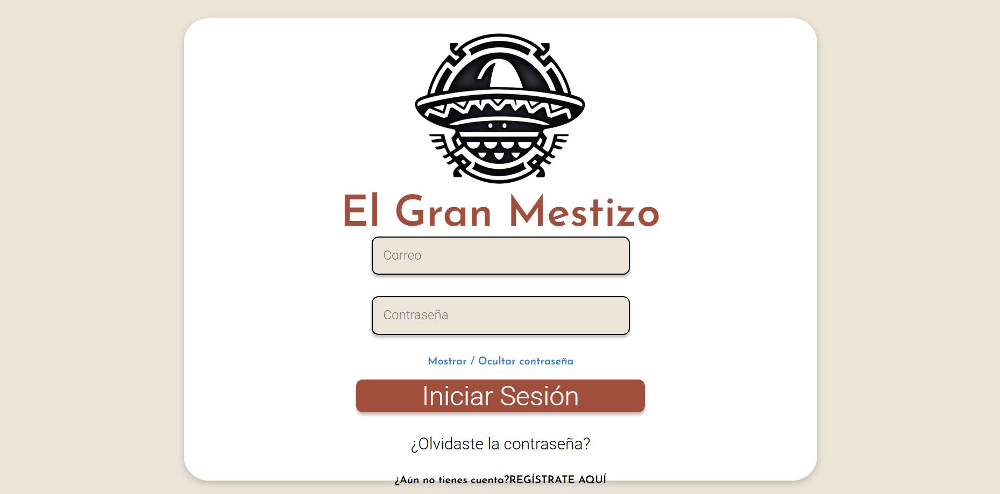

- **Registro**

El panel de registro permite la creación de una nueva cuenta que será cliente por defecto, requiere una verificación de contraseña y permite ingresar todos los datos necesarios para iniciar con las reservaciones

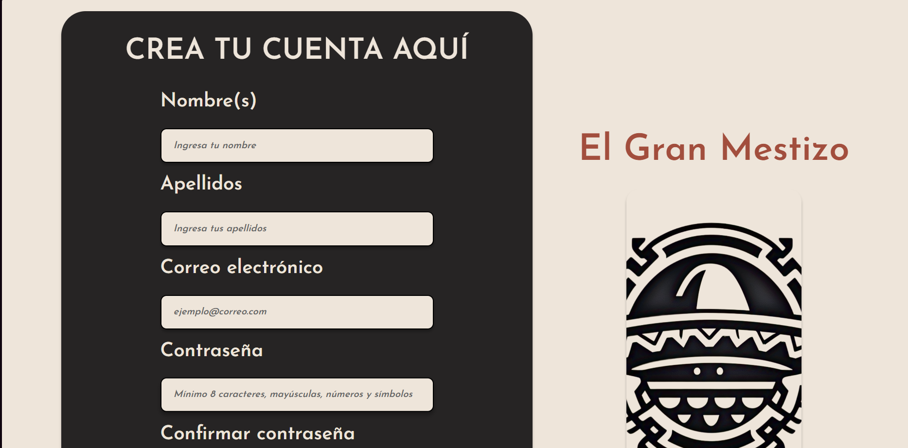

- **Reservaciones**

El formulario de reservaciones es gestionado por la API interna del sistema de reservas.
El usuario puede seleccionar una fecha hasta 15 días después de la fecha actual. La api interna procesará los datos para bloquear la posiblidad de reservar si hay un dia totalmente ocupado o filtrar para permitir reservas solo en horas disponibles (vease `ReservaDemoSeeder.php`)

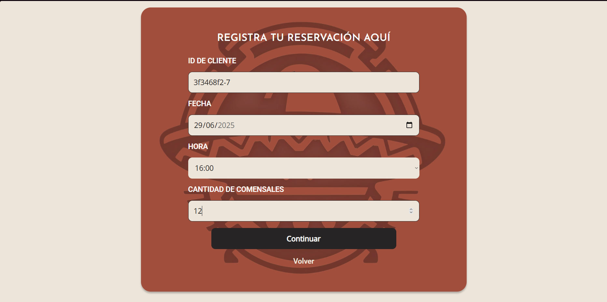

- **Correo de recuperación**

Este correo es enviado al rellenar una solicitud de cambio de contraseña, contiene HTML embebido con CSS para dar una apariencia profesional y limpia. Al hacer click en el botón, el usuario podrá recuperar su contraseña si el token aún es válido (Aún no es usado y no han pasado 60 minutos de su creación) 

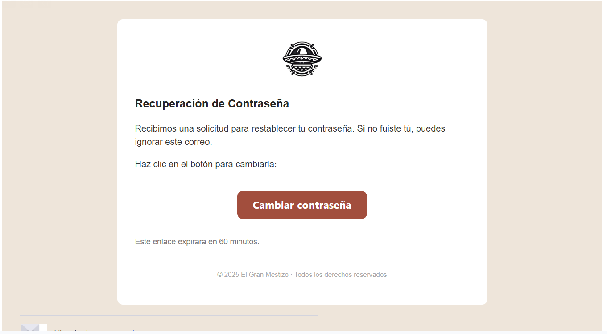

- **Panel Admin**

Este panel es el que se muestra a los administradores del sistema y permite realizar una gestión general de la aplicación

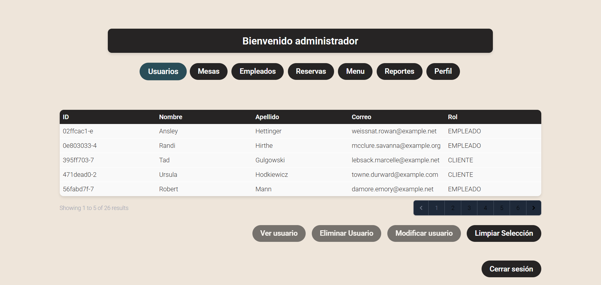

- **Panel Clientes**

Este panel es el que se muestra a los clientes del sistema y permite realizar reservaciones, cancelarlas, consultarlas, así como realizarlas y modificar sus datos personales o generar un reporte de acciones

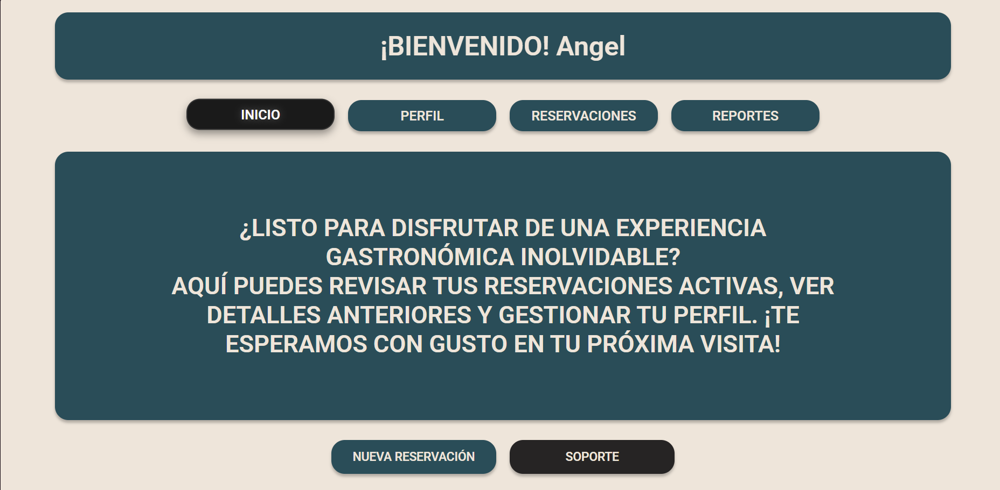

- **Panel Empleados**

Este panel es el que se muestra a los empleados del sistema y permite realizar acciones como registrar acciones, generar reportes y atender reservas

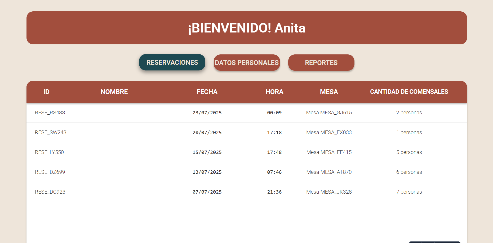

- **Menú de degustación**

El menú de degustación es una parte fundamental de la experiencia del restaurante y permite a los clientes ver los platillos que se ofrecen en el menú del día. Este menú es gestionado por el administrador y puede ser modificado en cualquier momento. El menú no muestra precios, ya que el sistema está diseñado para un modelo de negocio de menú de degustación sin precios visibles.

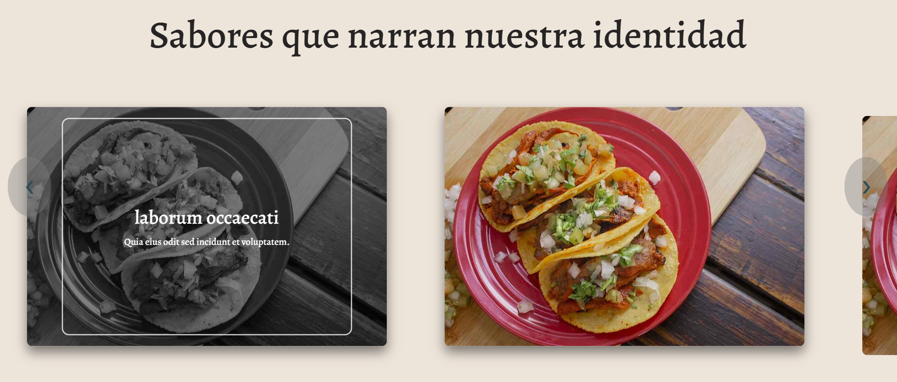

- **Error 403**

El error 403 se muestra cuando un usuario intenta acceder a una ruta que no tiene permisos para ver, por ejemplo, un cliente intentando acceder al panel de administración.
Al mostrar este error se da un mensaje claro al usuario de que no tiene permisos para acceder a esa ruta.

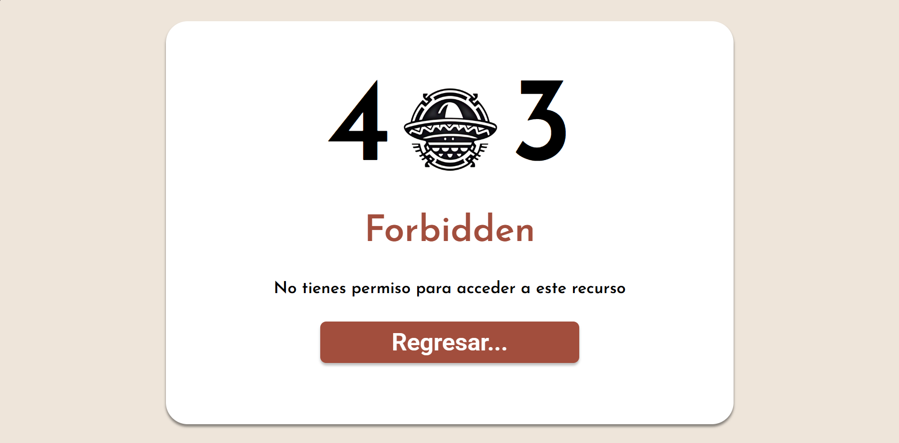

- **Error 404**

El error 404 se muestra cuando un usuario intenta acceder a una ruta que no existe en el sistema, por ejemplo, una ruta mal escrita o un recurso que no se encuentra.

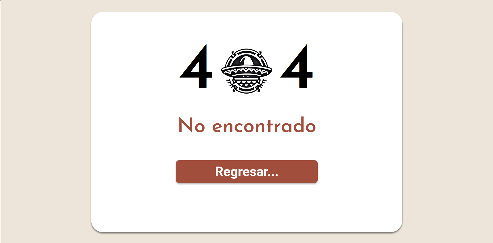

- **Recuperar contraseña**
El formulario de recuperación de contraseña permite al usuario ingresar su correo electrónico para recibir un enlace de recuperación

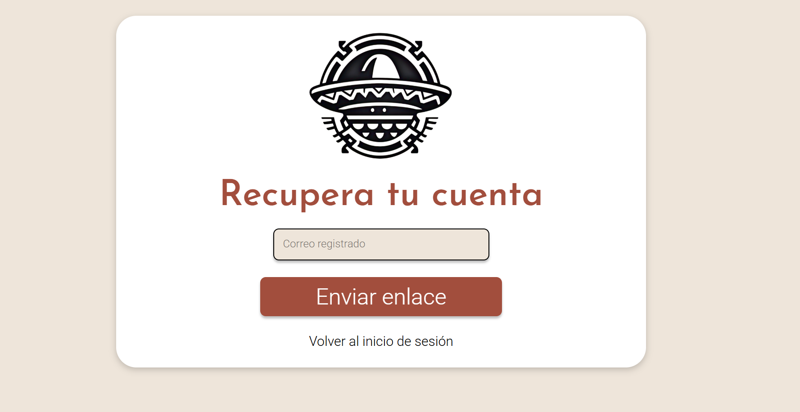

- **Cambiar contraseña**

El formulario de cambio de contraseña permite al usuario ingresar su nueva contraseña y confirmarla. Este formulario se muestra después de que el usuario hace clic en el enlace de recuperación enviado por correo electrónico.

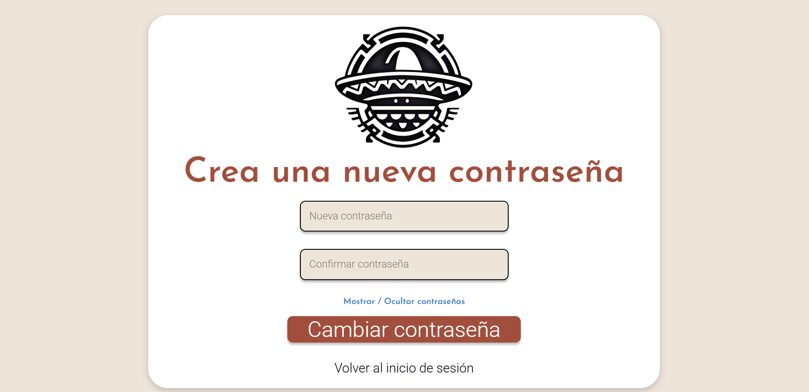
---

## Pruebas Automatizadas (PHPUnit)

Para ejecutar las pruebas automatizadas se debe ejecutar el comando:

```bash
php artisan test
```

Esto ejecutará una serie de 10 pruebas del sistema realizadas con PHPUnit. Estas pruebas se componen de 15 asertos y prueban lo siguiente:

* Prueba de ejemplo (true == true)
* Puede crear reservas correctamente
* Lanza una excepción si no hay mesas disponibles
* Puede cancelar una reserva
* Puede crear una reserva con mesas y meseros disponibles
* No puede crear reserva si no hay mesas suficientes
* No puede crear reserva si no hay meseros disponibles
* No puede usar mesa ya ocupada en mismo horario
* No puede reservar si todas las mesas ya están reservadas en ese horario
* Puede reservar la misma mesa en horarios diferentes

---

## Modelo de base de datos

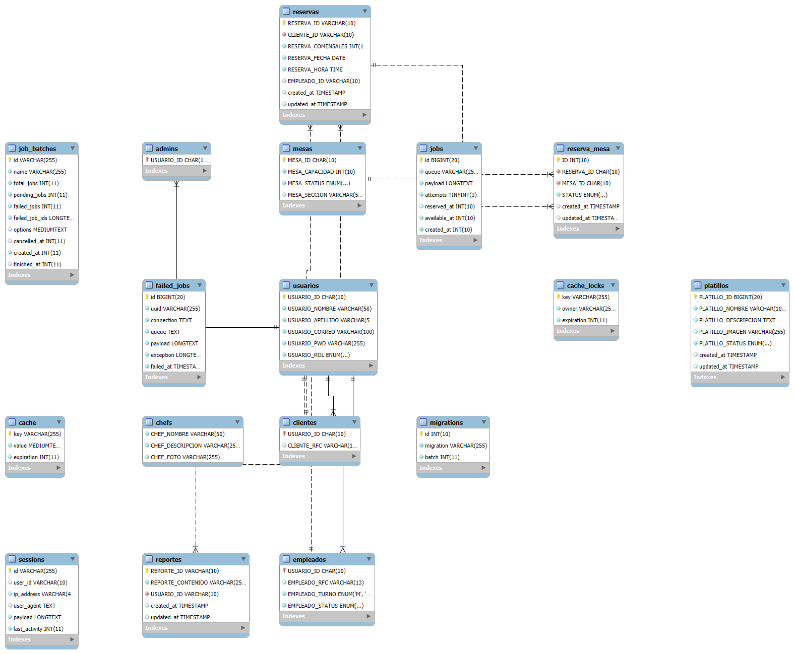

## Instrucciones para Clonar y Población de Base de Datos

### Clonación del repositorio

Para el correcto funcionamiento del proyecto, es necesario clonar el repositorio y poblar la base de datos con datos de ejemplo. A continuación se detallan los pasos:
1. Clonar el repositorio:

Se deben utilizar las siguientes instrucciones en la terminal:

```bash
git clone (enlace del repositorio)
composer install
composer update
copy .env.example .env
php artisan key:generate
```
2. Generar la base de datos:

Se debe crear una base de datos en MySQL y configurar el archivo `.env` con los datos de conexión. Asegúrate de que las variables `DB_DATABASE`, `DB_USERNAME` y `DB_PASSWORD` estén correctamente configuradas.

```bash
mysql -u root -p
CREATE DATABASE laravel_mestizo;
```

3. Configurar entorno

Asegúrate de que el archivo `.env` está correctamente configurado con los datos de conexión a la base de datos y otros parámetros necesarios. Además asegurate de que las "\" no hayan sido convertidas a "/" ya que esto puede causar problemas al intentar la ejecución del sistema.

3.1. Configurar el correo electrónico

Para que el sistema pueda enviar correos electrónicos, es necesario configurar los parámetros de correo en el archivo `.env`. Asegúrate de que las siguientes variables estén configuradas correctamente:

```plaintext
MAIL_MAILER=smtp
MAIL_HOST=smtp.gmail.com
MAIL_PORT=587
MAIL_USERNAME=correo de gmail
MAIL_PASSWORD=contraseña de gmail de app
MAIL_ENCRYPTION=null
MAIL_FROM_ADDRESS=igual que MAIL_USERNAME
MAIL_FROM_NAME="${APP_NAME}"
```

Si estás utilizando Gmail, asegúrate de haber configurado una contraseña de aplicación para permitir el acceso a tu cuenta desde Laravel. Esto es necesario si tienes habilitada la verificación en dos pasos.

4. Generar vinculos simbólicos
Para que las imágenes de los platillos se muestren correctamente, es necesario crear un enlace simbólico a la carpeta `storage`:

```bash
php artisan storage:link
```

5. Carga de helpers y comandos

Para que el sistema funcione correctamente, es necesario cargar los helpers y comandos personalizados. Esto se puede hacer ejecutando el siguiente comando:

```bash
composer dump-autoload
```

6. Población de la base de datos y migraciones

Para poblar la base de datos con datos de ejemplo, se deben ejecutar las migraciones y los seeders. Esto se puede hacer ejecutando los siguientes comandos:

```bash
php artisan migrate
php artisan db:seed
```

7. Uso de la migración de demostración

Si deseas poblar la base de datos con datos de ejemplo para probar el sistema, puedes ejecutar la migración de demostración:

```bash
php artisan migrate --seed --class=ReservaDemoSeeder
```

(Ten en cuenta que deberás ajustar la fecha de la migración en `ReservaDemoSeeder.php` para que se ajuste a la fecha actual, ya que las reservas están limitadas a 15 días después de la fecha actual).